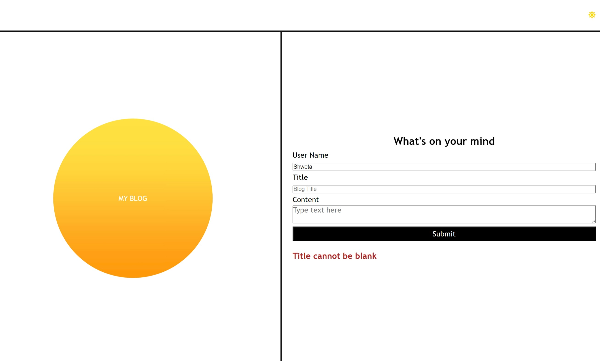

# my-personal-blog

## Description

Provide a short description explaining the what, why, and how of your project. Use the following questions as a guide:

- The application is a two page website where users will input and view blog posts.
- It includes building a content form, dynamically rendering blog posts, and implementing a light/dark mode toggle
- The implementation of this project helped apply my knowledge on html, css, javascripts, creating and traversing document object model(DOM), Event listeners, Local storage ,windows objects and github for repostitory management.


## Table of Contents 

- [Installation](#installation)
- [Usage](#usage)
- [User Story](#user-story)
- [Acceptance Criteria](#acceptance-criteria)
- [Tests](#tests)
- [License](#license)


## Installation

Follow these instructions to create your project and deploy it to GitHub Pages:

1. Create a new repository on your GitHub account and clone it to your computer.

2. When you're ready to deploy, use the git add, git commit, and git push commands to save and push your code to your GitHub repository.

3. Navigate to your GitHub repository in the browser and then select the Settings tab on the right side of the page.

4. On the Settings page, select Pages on the left side of the page. On the GitHub Pages screen, choose main in the dropdown under Branch. Click the Save button.

5. Navigate to <your-github-username.github.io/your-repository-name> and you will find that your new webpage has gone live! For example, if your GitHub username is "lernantino" and the project is "css-demo-site", then your URL would be <lernantino.github.io/css-demo-site>.


## Usage

Link for the repository :
https://github.com/shwetakadam5/my-personal-blog

Link for the webpage :
https://shwetakadam5.github.io/my-personal-blog/

Light Mode :


Dark Mode :


Error Messages :





Local Storage :


The project folder structure :

my-personal-blog
├── assets
│   ├── css
│   │   ├── blog.css
│   │   ├── form.css
    |   ├── reset.css
│   │   └── style.css
|   |      
│   └── scripts
│   ├   ├── blog.js
│   |   ├── form.js
|   |   └── logic.js
│   | 
|   ├── images
│       ├── <images*>.gif
│       ├── <inages*>.jpeg
│       └── <images*>.png
├    
|
|
├── LICENSE
├── index.html
├── blog.html
└── README.md

│    

## User Story

```md
AS A marketing student,
I WANT a personal blog
SO THAT I can showcase my thoughts and experiences.
```


## Acceptance Criteria

```md
GIVEN a personal blog
WHEN I load the app,
THEN I am presented with the landing page containing a form with labels and inputs for username, blog title, and blog content.
WHEN I submit the form,
THEN blog post data is stored to localStorage.
WHEN the form submits,
THEN I am redirected to the posts page.
WHEN I enter try to submit a form without a username, title, or content,
THEN I am presented with a message that prompts me to complete the form.
WHEN I view the posts page,
THEN I am presented with a header, with a light mode/dark mode toggle, and a "Back" button.
WHEN I click the light mode/dark mode toggle,
THEN the page content's styles update to reflect the selection.
WHEN I click the "Back" button,
THEN I am redirected back to the landing page where I can input more blog entries.
WHEN I view the main content,
THEN I am presented with a list of blog posts that are pulled from localStorage.
WHEN I view localStorage,
THEN I am presented with a JSON array of blog post objects, each including the post author's username, title of the post, and post's content.
WHEN I take a closer look at a single blog entry in the list,
THEN I can see the title, the content, and the author of the post.
WHEN I view the footer,
THEN I am presented with a link to the developer's portfolio.


## Tests

Application behaviour shared in the screenshots above

**Test 1**
- Click on the Submit button:  
    If the user name, title and content details are provided by the user:
         The details will be submitted successfully.
         The details will be saved in the local storage as an array of JSON Objects.
         The Blog details will be listed on the next page.
    If User input is not provided, the page will display an error message: User cannot be blank
    If Title input is not provided, the page will display an error message: Title cannot be blank    
    If Content input is not provided, the page will display an error message: Content cannot be blank  

**Test 2**
- Click on the Sun icon button avaialable on the header of both pages :
    The theme of the page is toggle between light and dark.
    On changing to dark theme, the icon will change to a Moon icon button.

**Test 3**
- Click on the Back button on the header of the Blog List page:
    The user will be navigated back to the Blog Entry page to input details.

**Test 4**
- Click on the Portfolio on the footer of the Blog List page:
    The user will be navigated to the portfolio page of the displayed user name
- Click on the Blog on the footer of the Blog List page:
    The user will be navigated to the blogs page of the displayed user name
- Click on the Email on the footer of the Blog List page:
    The user will be navigated to the mailto app to send an email

**Test 5**
- All the user inputs have default text displayed, which can be updated by the user

**Test 6**
- Hovering on the navigation links display appropriate texts.
- Hover on the link Portfolio : Hover text will display "Click to navigate to the blogger's portfolio"
- Hover on the link Blog : Hover text will display "Click to navigate to the blogger's blog page"
- Hover on the link Email : Hover text will display "Click to send email to shwetakadam5@gmail.com"

**Test 7**
- Hover on the Back Button : Hover text will display "Click here to navigate Back to the blog input page"
- Hover on the Sun/Moon Icon theme button : Hover text will display "Click here to toggle between light/dark mode"

**Test 8**
- Check if appropriate alt text is displayed if the image fails to load for some reason.

**Test 9**
- Check appropriate headers are displayed for every section.

**Test 10**
- Check the title of the webpage upon loading
    Blog Input Page : Blog-Home
    Blog List Page : Blog-Contents

**Test 11**
- All the blog details are stored in the local storage as a JSON Object list under the key : blogEntries
- The theme selected is also saved in local storage under the key :theme
## License

MIT

